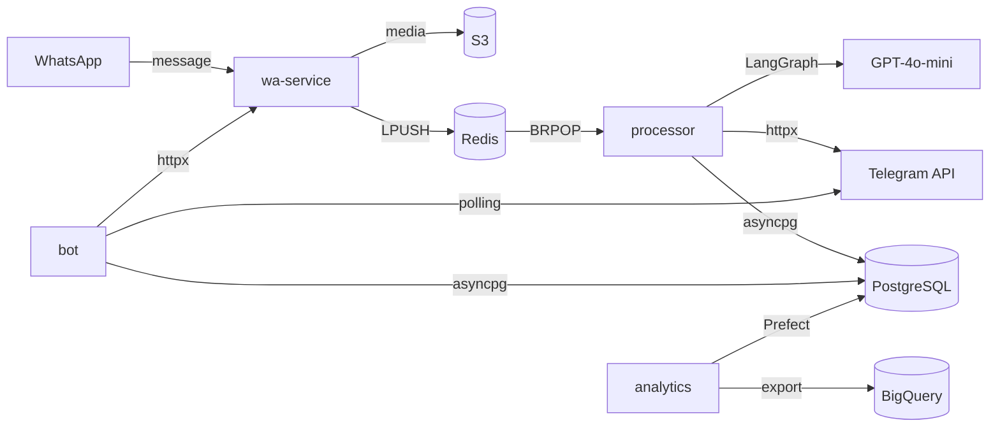

# Bridge v2

WhatsApp → Telegram message bridge with AI-powered translation. Receives WhatsApp messages, translates them via GPT-4o-mini, and delivers to linked Telegram chats in real time.


## Architecture



## Features

- **Real-time message forwarding** — WhatsApp messages appear in Telegram within seconds
- **AI translation** — GPT-4o-mini translates messages with cached results (24h TTL)
- **Media support** — photos, videos, documents uploaded to S3 and forwarded
- **LangGraph pipeline** — validate → translate → format → deliver with state tracking
- **Self-service onboarding** — scan QR, create Telegram group, link chats via bot commands
- **Analytics** — Prefect flows export message stats to BigQuery

## Services

| Service | Stack | Port | Description |
|---------|-------|------|-------------|
| `wa-service` | Node.js, Express, whatsapp-web.js, ioredis | 3000 | WhatsApp Web client, media upload to S3, message queue producer |
| `processor` | Python, FastAPI, LangGraph, asyncpg | 8000 | Message consumer, AI translation pipeline, Telegram delivery |
| `bot` | Python, python-telegram-bot, asyncpg | 8001 | Telegram bot for onboarding, chat pair management, commands |
| `analytics` | Python, Prefect, BigQuery | 4200 | Scheduled data flows, message stats export |

## Message Flow

```
WhatsApp incoming message
  └─ wa-service/handleIncomingMessage()
       ├─ uploadMedia() → S3
       └─ redis.LPUSH("messages:in", payload)

Processor consumer (BRPOP "messages:in")
  └─ LangGraph StateGraph:
       validate → translate → format → deliver
                                         ├─ httpx → Telegram API
                                         └─ asyncpg → message_events
```

## Onboarding Flow

1. User sends `/start` to the Telegram bot
2. Bot generates a connect link → `POST /connect/:userId` on wa-service
3. User scans the QR code with WhatsApp
4. Redis PUB `onboarding:qr_scanned:{userId}` → bot receives event
5. User creates a Telegram group and adds the bot
6. `/add` in the group → select WhatsApp chat → `INSERT chat_pairs`

States: `idle → qr_pending → wa_connected → linking → done`

## Quick Start

```bash
cp .env.example .env   # fill in API keys
make up                # start all services
make health            # verify endpoints
```

## Makefile Commands

| Command | Description |
|---------|-------------|
| `make up` | Start all services (docker compose up -d) |
| `make down` | Stop all services |
| `make restart` | Restart all services |
| `make logs` | Tail logs for all services |
| `make logs-{svc}` | Tail logs for a specific service (wa, processor, bot, analytics) |
| `make health` | Check /health endpoints for all services |
| `make test` | Run pytest for processor and bot |
| `make lint` | Run ruff check on all Python services |
| `make format` | Run ruff format on all Python services |
| `make build` | Build all Docker images |
| `make db-shell` | Open psql shell |
| `make migrate` | Apply database migrations |
| `make ecr-push` | Build and push all images to ECR |
| `make tf-plan` | Terraform plan |
| `make tf-apply` | Terraform apply |
| `make deploy-{svc}` | Force new ECS deployment for a service |

## Infrastructure (AWS)

| Resource | Service | Tier |
|----------|---------|------|
| ECS Fargate | Container orchestration | — |
| RDS PostgreSQL | Primary database | t3.micro |
| ElastiCache Redis | Message queue + cache | t3.micro |
| EFS | WhatsApp session storage (wa-service) | — |
| S3 | Media file storage | — |
| ECR | Docker image registry | — |

Terraform configs in `infra/terraform/`.

## CI/CD

**GitHub Actions** with two workflows:

- **ci.yml** — on push/PR: lint, test, build Docker images
- **deploy.yml** — on push to `main`: build → push to ECR → deploy to ECS

`wa-service` is deployed manually (EFS sessions require stop → start, not rolling update).

## Database Schema

4 tables in `infra/migrations/001_initial_schema.sql`:

| Table | Purpose | Key constraint |
|-------|---------|----------------|
| `users` | Telegram users | `tg_user_id` UNIQUE |
| `chat_pairs` | WhatsApp ↔ Telegram chat links | `(user_id, wa_chat_id, tg_chat_id)` UNIQUE |
| `message_events` | Message delivery log | `wa_message_id` UNIQUE |
| `onboarding_sessions` | Onboarding state machine | `user_id` PK |

All DB operations use `asyncpg` with connection pools, no ORM.

## Tests

```bash
make test   # runs pytest for processor + bot
```

13 tests covering the LangGraph pipeline nodes, onboarding state transitions, and chat pair management.
