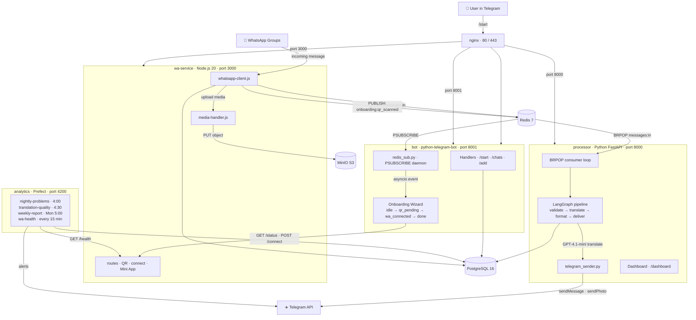

# Bridge v2 — Architecture

## Message flow

| Step | From | To | Transport |
|------|------|----|-----------|
| 1 | WhatsApp | wa-service | whatsapp-web.js |
| 2 | wa-service | MinIO | AWS SDK v3 |
| 3 | wa-service | Redis | LPUSH messages:in |
| 4 | Redis | processor | BRPOP |
| 5 | processor | OpenAI | httpx |
| 6 | processor | Telegram API | httpx |
| 7 | wa-service | bot | Redis pub/sub |
| 8 | bot | wa-service | HTTP REST |

## Stack

| Service | Key libs |
|---------|----------|
| wa-service | whatsapp-web.js, ioredis, pg |
| processor | FastAPI, LangGraph, asyncpg, httpx |
| bot | python-telegram-bot, asyncpg |
| analytics | Prefect, OpenAI, asyncpg |
